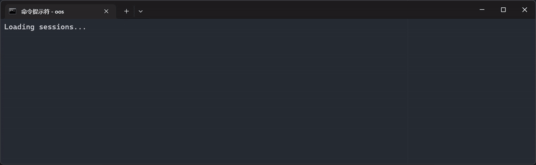

# oos — OpenCode Session Finder

> TUI interactive fuzzy finder for [OpenCode](https://opencode.ai) sessions. Search across all sessions from all projects at once — find any conversation by keyword and resume instantly.

<p align="center">
  
</p>

<p align="center">
  
  
  
</p>

## Why

You discussed a bug fix three weeks ago across three different projects. Which session was it in? You'd have to open each project and scroll through `opencode session list` one by one.

`oos` solves this: it reads your local OpenCode database and lets you search **across all sessions from all projects** at once. Type a keyword, see matches instantly, press Enter to continue the conversation right where you left off.

```
🥲 Before: open project → session list → scroll → wrong project → repeat
😎 After:  oos "bug fix" → Enter → right back to the conversation
```

## Demo

```
╭───────────────────────────────────────────────────────────────╮
│ bug fix                                                       │
╰───────────────────────────────────────────────────────────────╯
> c:\project1           │ xxx bug xxx fix xxxx      │ 07-14 16:32
  c:\project2           │ xxx fix xxx bug xxxx      │ 07-13 15:20
  c:\project3           │ fix bug xxxxxxxxxxxx      │ 07-10 13:40
─────────────────────────────────────────────────────────────────
type to search  enter: resume  esc: quit              3 matches
```

- **3 columns**: project directory | best matching message (context-matched) | timestamp
- **Real-time filter**: every keystroke instantly updates results
- **`!` marker**: directory path truncated → `!` indicates more parents above

## Install

Download the binary for your platform, rename to `oos` (or `oos.exe` on Windows), and place it in a directory on your `PATH`.

| Platform | GitHub | Gitee（中国镜像） |
|---|---|---|
| Windows 64-bit | [oos_windows_amd64.exe](https://github.com/wsaaaqqq/oos/releases/latest/download/oos_windows_amd64.exe) | [Gitee](https://gitee.com/haitao666/oos/releases) |
| Windows ARM64 | [oos_windows_arm64.exe](https://github.com/wsaaaqqq/oos/releases/latest/download/oos_windows_arm64.exe) | [Gitee](https://gitee.com/haitao666/oos/releases) |
| Linux 64-bit | [oos_linux_amd64](https://github.com/wsaaaqqq/oos/releases/latest/download/oos_linux_amd64) | [Gitee](https://gitee.com/haitao666/oos/releases) |
| Linux ARM64 | [oos_linux_arm64](https://github.com/wsaaaqqq/oos/releases/latest/download/oos_linux_arm64) | [Gitee](https://gitee.com/haitao666/oos/releases) |
| macOS Intel | [oos_darwin_amd64](https://github.com/wsaaaqqq/oos/releases/latest/download/oos_darwin_amd64) | [Gitee](https://gitee.com/haitao666/oos/releases) |
| macOS Apple Silicon | [oos_darwin_arm64](https://github.com/wsaaaqqq/oos/releases/latest/download/oos_darwin_arm64) | [Gitee](https://gitee.com/haitao666/oos/releases) |

### Uninstall

```bash
# Linux / macOS
curl -fsSL https://raw.githubusercontent.com/wsaaaqqq/oos/master/uninstall.sh | bash

# Windows
iwr -useb https://raw.githubusercontent.com/wsaaaqqq/oos/master/uninstall.ps1 | iex
```

## Usage

```bash
oos                  # search all sessions across all projects
oos java spring      # sessions matching both "java" AND "spring"
oos bug fix !plan    # find bug fix sessions, exclude plan agent
oos -v               # show version
oos --upgrade        # upgrade to latest release (GitHub + Gitee)
oos --upgrade v1.0.0 # install a specific version
oos -m <id>          # live monitor for one session (2s refresh)
oos -m               # global monitor: all sessions' newest messages
```

Type a keyword, see matching sessions from all projects instantly. `↑` / `↓` to pick the session, `Enter` to open and continue the conversation.

`Alt+Q` copy project path  ·  `Ctrl+D` twice to delete  ·  `Esc` quit

### Keyboard Shortcuts

| Key | Action |
|---|---|
| type keywords | real-time filter, space-separated AND logic, `!key` to exclude |
| `↑` / `↓` | move selection (`↑` at top deselects) |
| `Enter` | `cd` to project dir + open session with `opencode -s <id>` in a new tab (the tab stays open after you quit opencode) |
| `Ctrl+W` | delete last keyword |
| `Alt+Q` | copy project directory path to clipboard |
| `Alt+M` | open live monitor for selected session (no selection = global monitor) |
| `Ctrl+D` | delete session (press twice to confirm) |
| `Esc` | quit |

### Display Columns

| Column | Width | Description |
|---|---|---|
| Project dir | 24 cols | leaf dir in full, parents abbreviated to first char, `!` marks truncation |
| Matching message | 56 cols | best match from all messages (keyword-centered), hard-cut at boundary |
| Timestamp | 11 cols | `HH:MM` (today) or `MM-DD HH:MM` (older) |

## Search Scope

Every keyword is matched against the session metadata (title, slug, directory, model, agent, first user question) **and the full message history**. No mode to switch — history is loaded in the background at startup, so the top-right tag shows progress: `last 100 session loaded` → `all session loaded`.

## Monitor

Live message flow, refreshing every 2 seconds. Shows who said what, with which model, across sessions.

```bash
oos -m <id>    # one session + its subagent sessions
oos -m         # all top-level sessions, newest 300 messages
```

| Column | Meaning |
|---|---|
| TIME | message time |
| WHO | `user` = your question, agent name = that agent's reply |
| SESSION TITLE | which session the message belongs to (subagent sessions like `(@explore subagent)` show up here) |
| MODEL | provider/model that handled the message |
| INPUT | first 50 chars of the message text |

Scroll with `↑` / `↓` / `PgUp` / `PgDn`. Quit with `q` or `Ctrl+C`.

Open from the main TUI with `Alt+M`: with a selection it monitors that session, without one it opens the global monitor.

## How It Works

Reads `~/.local/share/opencode/opencode.db` (SQLite) — the same database OpenCode uses to store sessions and messages. All filtering happens in-memory.

| Phase | Data | Time |
|---|---|---|
| Startup (stage 1) | 100 most recent sessions + their first user message | ~1s |
| Startup (stage 2) | remaining sessions, merged in the background | ~1-3s |
| History index | all text parts from `part` table, one sequential scan | ~2-15s (cache-dependent) |
| Per-keystroke filter | in-memory O(n) scan | <1ms |

Typing works from stage 1 onward; results grow as the remaining stages complete.

## Tech Stack

| Component | Purpose |
|---|---|
| [Go](https://go.dev/) 1.24+ | language |
| [bubbletea](https://github.com/charmbracelet/bubbletea) | Elm-style TUI framework |
| [lipgloss](https://github.com/charmbracelet/lipgloss) | terminal styling |
| [modernc.org/sqlite](https://pkg.go.dev/modernc.org/sqlite) | pure-Go SQLite, no CGO |

## Related

- [OpenCode](https://opencode.ai) — the agentic coding tool this is built for
- [opencode session list](https://opencode.ai/docs/cli#session) — built-in session list command
